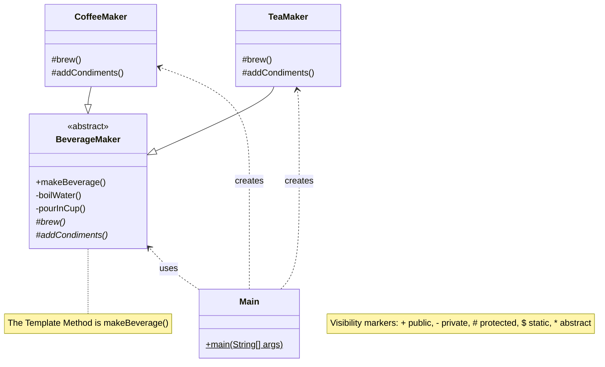

```mermaid
classDiagram
  direction BT
  class BeverageMaker {
    <<abstract>>
    +makeBeverage()
    -boilWater()
    -pourInCup()
    #brew()*
    #addCondiments()*
  }

  class CoffeeMaker {
    #brew()
    #addCondiments()
  }

  class TeaMaker {
    #brew()
    #addCondiments()
  }

  class Main {
    +main(String[] args)$
  }

  BeverageMaker <|-- CoffeeMaker
  BeverageMaker <|-- TeaMaker
  Main ..> BeverageMaker : uses
  Main ..> CoffeeMaker : creates
  Main ..> TeaMaker : creates

  note for BeverageMaker "The Template Method is makeBeverage()"
  note "Visibility markers: + public, - private, # protected, $ static, * abstract"
```
