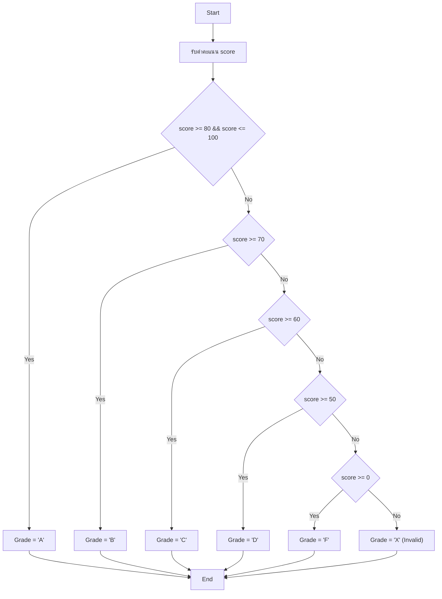

```mermaid
graph TD
    A[Start] --> B["รับค่าคะแนน score"];
    B --> C{"score >= 80 && score <= 100"};
    C -- Yes --> D["Grade = 'A'"];
    C -- No --> E{"score >= 70"};
    E -- Yes --> F["Grade = 'B'"];
    E -- No --> G{"score >= 60"};
    G -- Yes --> H["Grade = 'C'"];
    G -- No --> I{"score >= 50"};
    I -- Yes --> J["Grade = 'D'"];
    I -- No --> K{"score >= 0"};
    K -- Yes --> L["Grade = 'F'"];
    K -- No --> M["Grade = 'X' (Invalid)"];
    D --> N[End];
    F --> N;
    H --> N;
    J --> N;
    L --> N;
    M --> N;
```